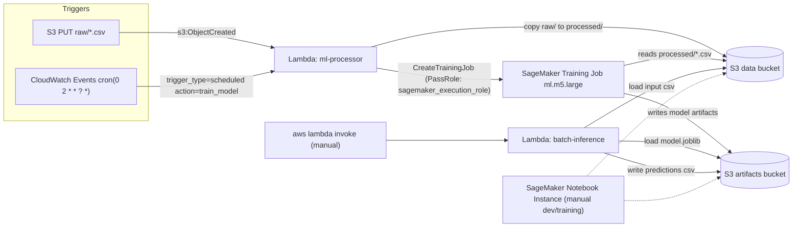

# SageMaker ML Pipeline (Terraform + Lambda)

Terraform-provisioned AWS scaffolding for a small ML pipeline: S3 buckets for data and model artifacts, a SageMaker notebook instance, and two Lambda functions that glue everything together. One Lambda reacts to new CSV uploads and kicks off SageMaker training jobs, the other runs batch inference against a saved model. There's no CI here and no orchestration framework (no Step Functions, no SageMaker Pipelines) - it's Lambda functions calling the SageMaker API directly, which keeps things cheap and easy to reason about at the cost of retries, state tracking, and error handling you'd want in anything real.

This sits alongside another repo of mine, AWS-Sagemaker-MLOps-Pipeline, which covers similar ground (S3/SageMaker/IAM scaffolding for a training-and-inference flow). Treat this repo as the "Lambda-orchestrated, event-driven trigger" variant: instead of a managed pipeline construct, plain Lambda functions respond to S3 events and a CloudWatch schedule to start training jobs and run inference. If you're looking at both, this is the more manual, lower-abstraction version of the same idea.

## Architecture



I used Lambda instead of a managed pipeline construct mainly because this started as a way to learn the SageMaker API surface directly rather than through an abstraction. The `ml-processor` Lambda has two entry points into the same code: an S3 notification (`raw/*.csv` uploads trigger `handle_s3_trigger`, which copies the file to `processed/` and, once there's at least one processed file, calls `sagemaker:CreateTrainingJob`), and a CloudWatch Events cron rule that fires the same training path daily at 2 AM UTC. A separate `batch-inference` Lambda is invoked manually (`aws lambda invoke`) rather than wired to any trigger - it loads a `joblib` model and a CSV from S3, runs `predict`/`predict_proba`, and writes predictions back to S3.

The IAM boundary is deliberately split in two: the Lambda execution role only gets `sagemaker:CreateTrainingJob/DescribeTrainingJob/StopTrainingJob/ListTrainingJobs` plus a scoped `iam:PassRole` for the SageMaker execution role - it never gets broad SageMaker permissions itself. The actual training job then runs under the separate `sagemaker_execution_role`, which holds `AmazonSageMakerFullAccess` plus the S3/CloudWatch/ECR permissions the training container needs. That way a compromised or buggy Lambda can start/stop jobs but can't do much else in SageMaker directly.

One thing worth flagging plainly: `start_training_job()` in `lambda_handler.py` calls `CreateTrainingJob` against the AWS-managed `sagemaker-scikit-learn` framework image but never sets the `sagemaker_program` / `sagemaker_submit_directory` hyperparameters that framework container expects, and `train_model.py` is never packaged up to S3 for it to pull down. So the training job the Lambda actually launches has no way of knowing to run `train_model.py` - `train_model.py` exists as a script you'd run by hand or from the notebook instance, not something that's actually wired into the automated trigger path. See Known gaps below.

## Project structure

```
.
├── terraform/              # All infrastructure
│   ├── main.tf              # Provider, VPC discovery/fallback, locals
│   ├── s3.tf                 # Data/artifacts/code buckets, lifecycle, encryption, S3->Lambda notification
│   ├── sagemaker.tf         # Notebook instance, VPC endpoints, security groups, alarms
│   ├── lambda.tf            # Both Lambda functions, packaging, CloudWatch schedule/alarms
│   ├── iam.tf                # Lambda execution role, SageMaker execution role, CloudWatch Events role
│   ├── variables.tf         # Inputs (instance types, timeouts, budget, etc.)
│   ├── outputs.tf            # Bucket names/ARNs, function names, ready-to-run CLI snippets
│   └── terraform.tfvars(.example)
├── scripts/
│   ├── lambda_handler.py     # ml-processor: S3 trigger + schedule trigger + direct invoke
│   ├── batch_inference.py    # batch-inference: loads model + data from S3, writes predictions
│   ├── train_model.py        # Standalone training script (generates synthetic data, trains a RandomForest)
│   └── deploy.sh              # Wraps terraform init/plan/apply + sample data upload
├── notebooks/
│   └── model_training_template.py  # Plain .py version of a notebook - copy into SageMaker/Jupyter to use
├── data/sample_data.csv     # Synthetic 4-feature classification sample
├── docs/DEPLOYMENT_GUIDE.md
└── requirements.txt
```

## How to run this

Deployment is manual - there's no GitHub Actions workflow in this repo, so `terraform apply` and any Lambda code changes are things you run yourself.

```bash
# 1. Configure Terraform variables
cd terraform
cp terraform.tfvars.example terraform.tfvars   # already checked in with the same defaults; edit as needed

# 2. Provision everything
terraform init
terraform plan -var-file="terraform.tfvars"
terraform apply -var-file="terraform.tfvars"

# 3. Upload sample data - this fires the S3 trigger automatically
DATA_BUCKET=$(terraform output -raw data_bucket_name)
aws s3 cp ../data/sample_data.csv "s3://${DATA_BUCKET}/raw/" --profile raj-private

# 4. Or trigger training directly, bypassing S3
FUNCTION_NAME=$(terraform output -raw ml_processor_function_name)
aws lambda invoke \
  --function-name "$FUNCTION_NAME" \
  --payload '{"action":"train_model"}' \
  response.json --profile raj-private
cat response.json

# 5. Run batch inference against a saved model
INFERENCE_FUNCTION=$(terraform output -raw batch_inference_function_name)
aws lambda invoke \
  --function-name "$INFERENCE_FUNCTION" \
  --payload '{"input_data_key":"processed/batch_input.csv","model_key":"models/latest_model.joblib"}' \
  inference_response.json --profile raj-private

# 6. Tear down
terraform destroy -var-file="terraform.tfvars"
```

`deploy.sh` wraps steps 1-3 plus the sample data upload with some prompts and colored output, if you'd rather run one script.

Everything defaults to the `raj-private` AWS profile and `eu-west-1`, both overridable via `terraform.tfvars`. The SageMaker notebook is `ml.t3.medium` (free-tier eligible) and training jobs default to `ml.m5.large`, both configurable through Terraform variables with validation on the allowed instance types.

## Known gaps

- **No CI.** No GitHub Actions workflow exists in this repo - Terraform changes and Lambda code updates are applied manually.
- **Training job isn't actually wired to `train_model.py`.** As described in Architecture, the `CreateTrainingJob` call the Lambda makes doesn't pass the framework container the hyperparameters it needs to locate and run a training script. `train_model.py` works as a standalone script but isn't invoked by the automated pipeline as currently written.
- **No retry logic or dead-letter handling.** Both Lambdas catch exceptions and return an error payload, but nothing retries a failed training job or a failed batch inference run, and there's no DLQ on either function.
- **No tests.** `requirements.txt` lists `pytest`/`pytest-cov`/`flake8`/`black`, but there are no test files in the repo.
- **Batch inference Lambda package is built with a local `pip install -t .`.** `lambda.tf` shells out to `pip3 install pandas scikit-learn joblib numpy -t .` on whatever machine runs `terraform apply`. If that machine isn't running a Lambda-compatible Linux/glibc environment, the compiled wheels (numpy, scikit-learn) can mismatch the Lambda runtime.
- **Hardcoded defaults throughout.** The `raj-private` AWS profile and `eu-west-1` region are the defaults in `variables.tf`, `deploy.sh`, and `terraform.tfvars`; the SageMaker training image ARN (`683313688378.dkr.ecr...`) is hardcoded in both `lambda.tf` (placeholder model resource) and `lambda_handler.py`.
- **No monitoring beyond two CloudWatch alarms** (Lambda errors, Lambda duration) with no `alarm_actions` configured, so they don't actually notify anyone.
- **The committed `terraform.tfvars` is identical to `terraform.tfvars.example`** - it's checked in with placeholder values, not a real deployment's config, so review it before applying.
